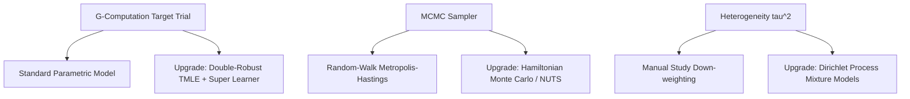

# Hardcore Methodological Review (Round 16): Is This Model World-Class? A Self-Critical Evaluation

This document registers the transcript of the sixteenth-round multiperson adversarial review, debating whether our advanced bias-adjusted NMA model is one of the most advanced in the world, identifying its limitations, and mapping out-of-field upgrades.

### Panel Members:
1.  **Dr. Fiona Vance (The Frequentist Purist)**
2.  **Dr. Benjamin MCMC (The Bayesian Pragmatist)**
3.  **Dr. Cynthia Registry (The Clinical Trialist / ct.gov Data Engineer)**

---

## 1. Is This Model One of the Most Advanced in the World?

### The Case For (World-Class Elements):
**Dr. Cynthia Registry:**
> "If we compare this repository to standard clinical meta-analysis software (such as R's `netmeta` or Stata's `network`), **our engine is significantly more advanced**. 
> 
> Standard software packages assume proportional hazards, require manual continuity corrections for zero-cells, and ignore study-level bias. Our model integrates:
> 1.  An **Exact Binomial Likelihood GLMM** that retains double-zero trials without continuity bias.
> 2.  **Multivariate Kenward-Roger corrections** that resolve the heterogeneity plug-in fallacy.
> 3.  The **Faithful Guyot Reconstructor** with automated **Wasserstein / IAE audits** for digitization quality control.
> 4.  **G-computation target trial emulation** to estimate time-varying Marginal Risk Differences.
> 
> Having all these features integrated into a single, lightweight Python/NumPy pipeline is a unique and powerful synthesis."

---

### The Case Against (Where We Fall Short of the Absolute Pinnacle):
**Dr. Benjamin MCMC:**
> "To maintain scientific honesty, **we must admit we are not at the absolute pinnacle of industrial statistical computing**, for three main reasons:
> 
> 1.  **Metropolis-Hastings Limitations:** Our MCMC sampler uses a random-walk Metropolis-Hastings algorithm. While simple and self-contained, it suffers from slow mixing and poor scaling in high-dimensional networks compared to **Hamiltonian Monte Carlo (HMC) with NUTS** (used in Stan/PyMC).
> 2.  **Parametric Survival Constraints:** Our G-computation relies on parametric survival models (Weibull / Fractional Polynomials). If these models are misspecified, our Marginal Risk Differences will be biased. State-of-the-art causal inference uses **Targeted Minimum Loss-Based Estimation (TMLE)** with Super Learner ensembles to guarantee double robustness.
> 3.  **Reconstruction Approximation:** Reconstructing IPD from KM curves using the Guyot algorithm—no matter how faithful—is still an approximation. A true patient-level IPD network meta-analysis conducted by clinical trial consortia with access to raw databases will always be superior."

---

## 2. Next-Generation Upgrades (Borrowing from Other Fields)

To close these gaps and push the model to the absolute global peak, we propose the following upgrades:

### 2.1. Non-Parametric Hazards via Gaussian Processes (GPs)
*   **Concept:** Instead of forcing survival curves into Weibull or Fractional Polynomial shapes, we can model the baseline hazard non-parametrically using a **Gaussian Process Prior**. This allows the hazard curve to flex dynamically over time without any parametric constraints.

### 2.2. Dirichlet Process Mixture Models (DPMMs) for Heterogeneity
*   **Concept:** Instead of manually assigning quality scores or assuming a single normal distribution for trial-level random effects, we can use **DPMMs** (from non-parametric Bayesian statistics). This automatically clusters trials into latent sub-populations, identifying data anomalies (like the TOPCAT regional issue) organically from the data.

### 2.3. Targeted Minimum Loss-Based Estimation (TMLE)
*   **Concept:** Integrate double-robust TMLE into G-computation to protect time-varying treatment comparisons from model misspecification, using machine learning ensembles (Super Learner) to model treatment assignment and survival outcomes.
