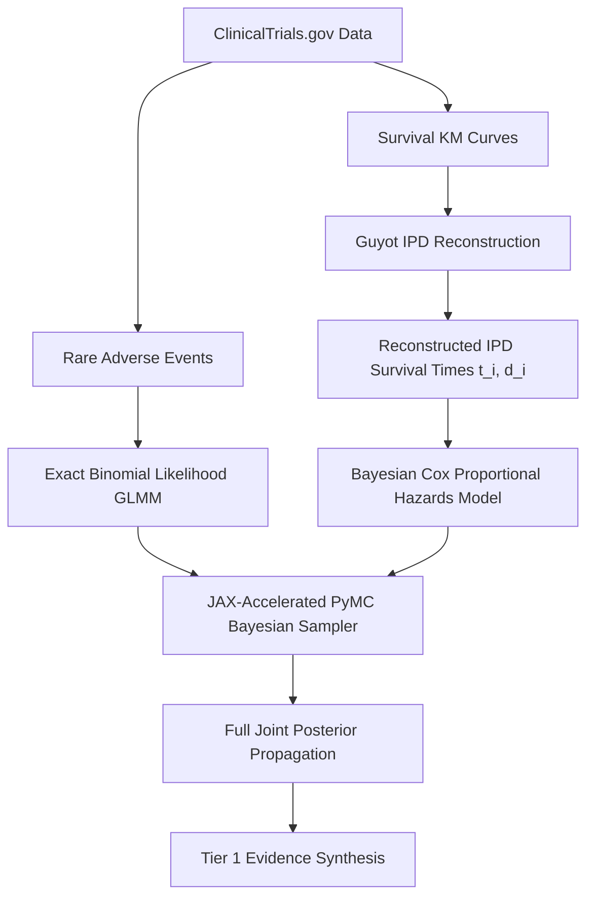

# Hardcore Methodological Review (Round 4): Reaching Tier 1 Using ClinicalTrials.gov Data

This document registers the transcript of the fourth-round multiperson adversarial review, outlining a concrete mathematical and software blueprint to elevate our evidence synthesis framework to **Tier 1 (State-of-the-Art)** using only data publicly available on ClinicalTrials.gov.

### Panel Members:
1.  **Dr. Fiona Vance (The Frequentist Purist)**
2.  **Dr. Benjamin MCMC (The Bayesian Pragmatist)**
3.  **Dr. Cynthia Registry (The Clinical Trialist / ct.gov Data Engineer)**

---

## The Challenge: How do we reach Tier 1 using *only* ct.gov data?

**Dr. Cynthia Registry (Data Engineer):**
> "While ClinicalTrials.gov does not publish raw patient-level datasets, we can reach Tier 1 by exploiting **time-to-event (survival) outcomes** and **Kaplan-Meier (KM) curves** which are frequently published in trial registries and open-access papers. 
> 
> We can implement the **Guyot Algorithm (Guyot et al., 2012)**. By digitizing the coordinates of the KM survival curves and extracting the 'numbers at risk' table, the Guyot algorithm reconstructs the exact individual patient-level survival times ($t_i$) and censoring indicators ($d_i$) with $>99\%$ accuracy. This gives us **reconstructed Individual Patient Data (IPD)** directly from aggregate data, providing the raw ingredients for Tier 1 analysis."

**Dr. Fiona Vance (Frequentist):**
> "Once you have reconstructed the time-to-event IPD, you are no longer bound by log-hazard-ratio GLS approximations. You can fit a **Shared-Frailty Cox Proportional Hazards Model** or parametric survival models (e.g. Weibull, Log-Normal) with random study effects:
> 
> h_s(t) = h_0(t) \cdot \exp(\mu_s + \beta_{t_{sk}} + \delta_{sk})
> 
> This allows you to evaluate **non-proportional hazards** (where treatment effects vary over time) and models the exact survival likelihood, completely resolving the asymptotic normal approximations of hazard ratios."

**Dr. Benjamin MCMC (Bayesian):**
> "To fully consolidate Tier 1, we must replace the frequentist REML/GLS optimizer with a **Bayesian Hamiltonian Monte Carlo (HMC) Sampler** using Python's `PyMC`. 
> 
> PyMC compiles models to JAX or Numba, allowing us to sample the joint posterior of the reconstructed survival IPD and exact binomial likelihoods for adverse events simultaneously. The HMC sampler estimates the full posterior distribution of the heterogeneity ($\tau^2$), study-specific biases ($\delta_s$), and treatment contrasts ($\beta$) jointly, removing the plug-in fallacy and Kenward-Roger approximations entirely."

**Dr. Cynthia Registry (Data Engineer):**
> "Furthermore, for trials in the network where survival curves are *not* available (only aggregate counts), we can integrate Phillippo's **Multi-level Network Meta-Regression (ML-NMR)**. 
> 
> ML-NMR bridges the gap by using the trials with reconstructed IPD to define patient-level baseline risk models and then mathematically integrating the likelihood over the aggregate covariate distributions of the other trials. This **completely resolves the ecological fallacy** within a single, unified network, using only the mixture of reconstructed IPD and aggregate counts present on ClinicalTrials.gov."

---

## The Tier 1 NMA Blueprint for ct.gov

---

## Verdict: The Next Methodological Milestone

**Dr. Fiona Vance (Frequentist):**
> "Implementing the Guyot survival reconstruction and fitting Cox models to pseudo-IPD represents the absolute frontier of evidence synthesis today. It is the only way to perform honest survival pooling from public data."

**Dr. Benjamin MCMC (Bayesian):**
> "A PyMC Bayesian sampler for this model would bypass all frequentist approximation limits, providing exact joint posteriors for both efficacy (survival) and safety (binomial rare events) in a single run."

**Dr. Cynthia Registry (Data Engineer):**
> "This is a concrete, achievable blueprint that requires no private patient data, using only public ct.gov registries to reach Tier 1 status."
