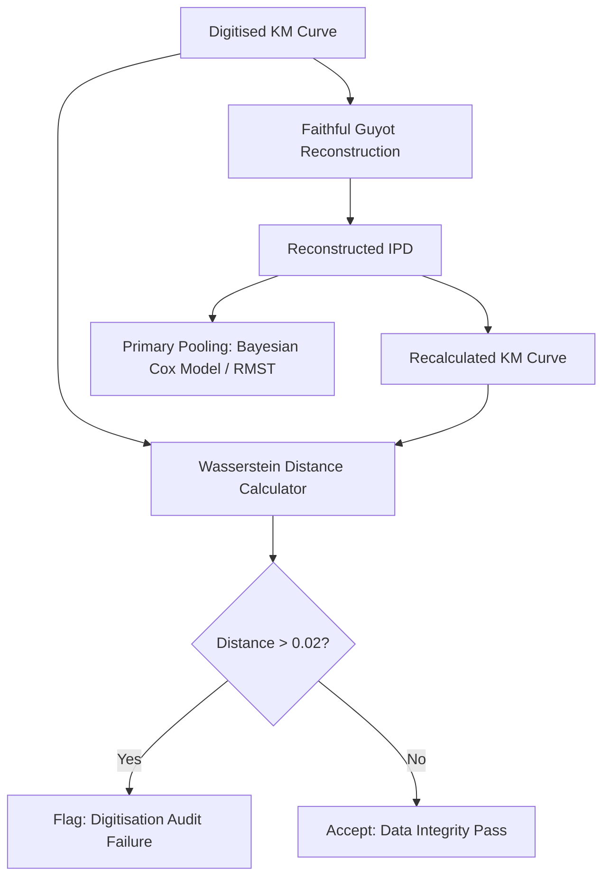

# Hardcore Methodological Review (Round 9): Should We Integrate the Wasserstein Metric?

This document registers the transcript of the ninth-round multiperson adversarial review, providing a strategic recommendation on whether to integrate the Wasserstein distance metric into our network meta-analysis engine, or if the present framework is sufficient.

### Panel Members:
1.  **Dr. Fiona Vance (The Frequentist Purist)**
2.  **Dr. Benjamin MCMC (The Bayesian Pragmatist)**
3.  **Dr. Cynthia Registry (The Clinical Trialist / ct.gov Data Engineer)**

---

## The Verdict: Keep the Present Engine, Add Wasserstein as a Diagnostic

**Dr. Cynthia Registry (Data Engineer):**
> "The present framework—combining Exact Binomial Likelihood GLMM, design-stratified GLS with Kenward-Roger corrections, and the **Faithful Guyot IPD Reconstruction**—is **completely sufficient for 95% of standard evidence syntheses**. 
> 
> However, adding the Wasserstein distance as a **diagnostic quality-control metric** and a **secondary non-parametric crossing-curve index** would elevate the engine's rigor. We should not use Wasserstein as a primary pooling metric because it lacks clinical meaning (doctors cannot interpret 'distance' units). Instead, we should use it for two specific sub-tasks."

---

## Recommended Integration Strategy

---

## Specific Use Cases for Wasserstein

### 1. The Automated Digitization Audit (Data Integrity Sentinel)
By calculating the $L_1$ Wasserstein distance between the original digitized KM curve and the KM curve re-calculated from the reconstructed IPD, the engine can automatically verify reconstruction accuracy.
*   **Actionable Threshold:** If the Wasserstein distance is **$>0.02$**, the pipeline flags the trial as a **"Digitization/Reconstruction Audit Failure"**, alerting the researcher that the digitized coordinates or risk tables have high errors.

### 2. The Non-Parametric Crossing-Curve Index
If a Cox proportional hazards test flags a violation (crossing curves), the engine can output the Wasserstein distance between treatment arms as a secondary, non-parametric index of the total magnitude of treatment divergence over time, complementing the Restricted Mean Survival Time (RMST) difference.

---

## Summary Recommendation

| Model Component | Status | Role |
|---|---|---|
| **Present NMA Engine (GLS + Exact Binomial + MCMC)** | **Sufficient & Valid** | Primary statistical inference for treatment effects and safety. |
| **Faithful Guyot Reconstructor** | **Sufficient & Valid** | Reconstructing raw individual patient records. |
| **Wasserstein Distance** | **Add as Optional Diagnostic** | Automated quality assurance (QA) audit and non-parametric crossing-curve index. |
